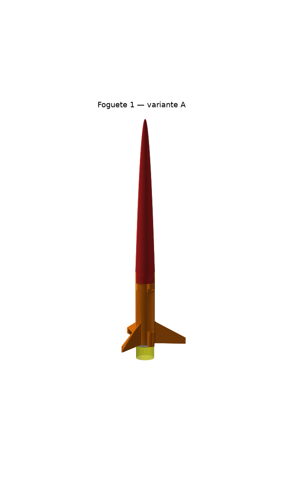

# Foguete 1 — OBAFOG Modelo 5 (alcance)

Corpo de 26 mm impresso, ogiva longa com lastro de massa epóxi no bico, lata de aletas com
luva do motor e as duas guias, motor oficial da OBAFOG preso pelo tubo (o cap fica livre).
Feito para a 100ª Jornada de Foguetes, Turma 15, e serve para a etapa escolar da 21ª OBAFOG.

## Qual imprimir

| | **Variante A** (recomendada) | Variante B (impressora baixa) |
|---|---|---|
| Arquivo | `F1_construtivel_v1.ork` | `F1_construtivel_v1B_ogiva_curta.ork` |
| Peças | **2**: ogiva + lata (as duas guias na lata, alinhadas por construção) | 3: ogiva + tubo + lata (colar com a haste) |
| Ogiva | série de potência (½), 205 mm → **precisa de 220 mm de altura de impressão** | elipsoidal, 150 mm → 165 mm de altura |
| Aletas | 3 x (raiz 30, ponta 8, envergadura 42, bordo de fuga reto), 1,6 mm | 4 x (29, 9, 36), 1,6 mm |
| Lastro de massa epóxi no bico | **12 g** | **9 g** |
| Massa na decolagem (com motor) | **86 g** | 89 g |
| Margem estática com motor / queimado | **1,41 / 2,06 cal** | 1,41 cal |
| Alcance, motor nominal 7 N·s, 44°, sem vento | **384 m** | 363 m |
| 5 / 9 / 11,5 N·s | 248 / 495 / 603 m | 234 / 469 / — |
| Monte Carlo (200 voos com vento, rajada, motor e montagem sorteados) P10 / mediana / P90 | **249 / 386 / 508 m** | 234 / 365 / 484 m |

Massas das peças (do CAD): variante A → ogiva 11,7 g, lata 18,7 g. Tudo em
`F1_construtivel_v1_resumo.json`.

**Expectativa honesta:** o OpenRocket deu mais alcance que o real quando testado nas garrafas
da OBA; conte com algo 10–30% abaixo dos números acima até o primeiro voo de teste.
Garrafas típicas da OBA fazem 100–180 m com o mesmo motor.

## Ângulo da haste (variante A; média dos motores de 5, 7 e 9 N·s)

| Vento na direção do lançamento | Ângulo | Alcance médio |
|---|---|---|
| calmo | **44°** | 376 m |
| 2 m/s de frente | 48° | 363 m |
| 4 m/s de frente | 48° | 350 m |
| 6 m/s de frente | 52° | 337 m |
| 2 m/s de cauda | 44° | 388 m |
| 4 m/s de cauda | 40° | 400 m |
| 6 m/s de cauda | 40° | 412 m |
| 4 m/s lateral | 44° | 364 m |

A curva é **plana**: entre 40° e 48° sem vento o alcance muda menos de 6 m, então a flexão da
haste de 6 mm (~2,5°) quase não pesa. Mesmo assim, meça na metade de cima da haste.
Vento de cauda forte com o motor mais fraco é o pior caso (o foguete empina): prefira esperar
a rajada passar.

## Por que essa forma (resumo da otimização)

- ~2.800 projetos simulados, cada um com 9 a 32 combinações de motor (5–11,5 N·s, 3 formatos
  de curva) e vento (de frente, de cauda, lateral), com margem ≥ 1,2–1,35 cal, saída da vara
  ≥ 11 m/s, flutter com fator ≥ 1,5 e aleta imprimível sem suporte.
- **Mais leve voa mais longe** (correlação −0,88); a ogiva longa dá o braço de alavanca para a
  estabilidade com menos área molhada e menos massa que um tubo, e deixa o lastro bem na frente.
- Comparação no mesmo conjunto de cenários (arquivo `comparacao_S2.json`):

| Projeto | Média | Pior caso | Nominal |
|---|---|---|---|
| Ótimo teórico (aleta 18 x 1,2 mm, frágil) — `F1_teorico_v1.ork` | 381 m | 224 m | 392 m |
| **Construtível (A)** | **362 m** | **205 m** | **370 m** |
| Projeto "humano" (física e intuição, sem otimizar) | 279 m | 151 m | 284 m |

  A aleta robusta custa ~20 m de média; o otimizado ganha ~80 m do projeto feito à mão.
- **Tolerância de fabricação** (`F1_construtivel_v1_resumo.json`, `sensibilidade`): nenhuma
  cota ±1–2 mm muda o alcance em mais de 8 m nem a margem em mais de 0,07 cal. O que mais pesa
  é a massa das peças impressas (±8% → ±8 m) e a do cap (±1,5 g → ±0,06 cal). Pese tudo.

## Arquivos

| | |
|---|---|
| `F1_construtivel_v1.ork` / `..._v1B_ogiva_curta.ork` | abra no OpenRocket 24.12; 9 simulações prontas |
| `F1_teorico_v1.ork` | ótimo teórico, só para referência (não construir) |
| `stl/<versão>/` | STL na orientação de impressão + `gabaritos/` + `massas_cad.json` |
| `moldes/transferidor_haste.pdf` | transferidor que lê a elevação da haste com fio de prumo |
| `MONTAGEM.md` | gabaritos, impressão, colagem, lastro, conferência de CG, motor |
| `CHECKLIST_JORNADA.md` | EPI, raia, vento, ângulo, pós-voo |
| `graficos/<versão>/` | trajetórias, alcance x ângulo, Monte Carlo |
| `otimizacao/` | todas as avaliações (JSONL) |
